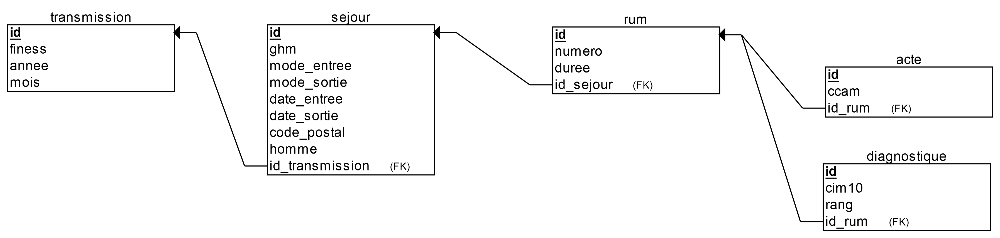

# Proof of Concept
J'ai ajouté sur le dépot du projet un dossier ["proof_of_concept"](https://github.com/AdrienLeGuillou/PMSI_DB/tree/master/proof_of_concept) qui est un première jet pour illustrer PMSI_DB.
Voici sont contennu :
* un dossier "monetdb". Il est vide et sert de dossier pour la base [monetDB]()
* [diagram-draft.erdplus](https://github.com/AdrienLeGuillou/PMSI_DB/blob/master/proof_of_concept/diagram-draft.erdplus) qui s'ouvre avec [ERDplus](https://erdplus.com/#/standalone) et permet de voir de manière graphique le schema de donné
* [diagram-draft.png](https://github.com/AdrienLeGuillou/PMSI_DB/blob/master/proof_of_concept/diagram-draft.png) qui est la version png du même diagram.
* [getkey.sql](https://github.com/AdrienLeGuillou/PMSI_DB/blob/master/proof_of_concept/getkey.sql) contenant des draft de query SQL dont je me sert pour l'implémentation (il peut être supprimé sans risques)
* [make_tables.sql](https://github.com/AdrienLeGuillou/PMSI_DB/blob/master/proof_of_concept/make_tables.sql) qui contient les requètes de création de la structure de la base. Il est exécuté pièce par pièce via R.
* [markers.R](https://github.com/AdrienLeGuillou/PMSI_DB/blob/master/proof_of_concept/makers.R) contennant les fonctions de création des tables et de leur inclusion dans la base
* [proof_of_concept.R](https://github.com/AdrienLeGuillou/PMSI_DB/blob/master/proof_of_concept/proof_of_concept.R) qui est le script permettant de créer la base, importer de fichiers et tester des requêtes.

## Qu'est ce que ça fait à présent ?
L'idée était de me familiariser avec monetDB et la conception de base en SQL. Jusqu'à présent je ne faisait que de la requête en lecture. J'ai donc travaillé uniquement sur le fichier .rsa des archives .out et ai conçu un schema simple pour illustrer le projet.

### Le format
Voici le dis schema :

Il contient donc 4 tables :
__transmission__ : qui contient les informations relatives au fichier de transmission source
__sejour__ : avec un certain nombre d'information relative au séjour ou au patient
__ rum__ : infos sur les RUM au sein d'un séjour
__diagnostique__ et __acte__ : qui se comprennent d'elles même

De plus la base de donnée contient 4 ["vues" (views en anglais)](https://en.wikipedia.org/wiki/View_(SQL)) qui sont pour faire simple des table "construites" à partir de requête sur les données et que l'on peut appeller comme les autres. En l'ocurrence il s'agit de vues contenant par séjour le nombre de rum, de diagnostique et d'acte respectivement ainsi qu'un quatrième joignant tout cela.
Le but était ici de montré la possibilité de construire la base en respectant une normalisation strict, ce qui peut complexifier le requétage, mais avec des vues permettant de retrouver des tables plus famillière si on le souhaite.

### L'implémentation avec R
J'ai utilisé [pmeasyr](https://github.com/IM-APHP/pmeasyr) pour extraire les tables et le [tidyverse](https://www.tidyverse.org) pour les manipulations. Mon implémentation est surement peu efficient et le code relativement moche mais il fait le job pour un premier jet. Dans les difficultés notable que j'ai pu rencontrer je peux citer la gestion des clé primaire et secondaire lorsque l'on ajoute plusieurs archives ainsi que l'inconsistence du champs "numéro séquentiel du RUM" dont le sens change après 2012.

### Le test
Le fichier proof of concept permet de :
1. Creer une base de donnée et sa structure
2. Y importer les tables issue d'archives .out (une boucle sur les années et finess est incluse), (la fonction rsaout_to_db(con, p) gere la décompression de l'archive et la suppression des fichiers par la suite)
3. Appliquer summary sur chacune des tables comme micro test d'importation
4. Calculer des summary statistiques sur chacun des différents import pour tester les "vues"

### Problèmes rencontrés
De mon coté j'ai tester l'importation de ~420 000 séjours issu de 4 hopitaux de 2011 à 2016. L'execution du script à pris environ 5 minutes sur ma machine. J'ai eu besoin de fermet tous les programmes autre que Rstudio sinon je rencontrai une erreur d'allocation qui semblait être en lien avec la RAM bien que je ne consommais jamais plus de 50% durant l'execution du script.

## La suite
Bien évidement cette étape n'est pas représentative du format définitif de la base. Les noms des variables et des tables ont été choisi rapidement pour pouvoir mettre en place un prototype. Il en est de même pour le code R qui est spartiate.

Je vois la suite du projet comme suit :
1. Incorporer dans une structure l'ensemble des variables du .rsa en commençant par 2011 et en ajoutant les nouveautés (ce qui implique un nombre important de table)
2. Améliorer l'implémentation en déléguant un maximum de tache au RDMS afin d'être le plus indépendant de R possible. Cela simplifie la maintenance.

En parallèle il faut que je réfléchisse sur les conventions à adopter pour la base de données ainsi que je fasse une documentation des tables, variables et vues.
Il serait aussi important de travailler sur une validation de l'importation pour s'assurer que je ne perde pas de l'information lors de la transformation.

## Contribution
Ce projet est conséquent. Bien que de mon coté j'ai besoin d'un tel système si vous souhaitez y participer toutes les contributions sont les bienvenues. Je ne suis pas un expert en base de données et profite aussi de ce projet pour me former. N'ayez donc pas peur de m'apprendre des chose :)

*par ailleurs et comme vous l'avez sans doute constaté, je ne suis pas non plus un expert en expression écrite. Je m'excuse pour le saignement de vos yeux*
